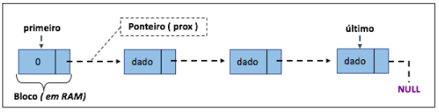
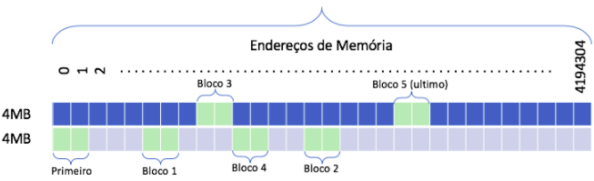
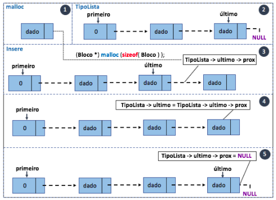
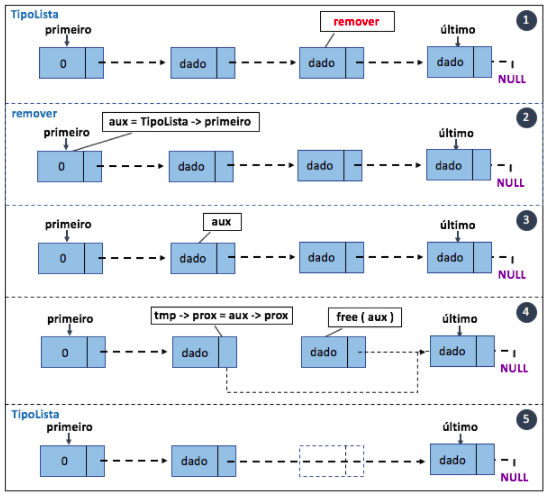

# Listas Dinâmicas: Implementação em C

 
 
 
 

 

 

A lista dinâmica é uma variante do modelo estático [vide git](https://github.com/mpiress/linear_list). Assim, antes de apresentar as modificações existêntes nessa implementação, vejamos uma representação gráfica do modelo dinâmico em questão. Observe as nomenclaturas utilizadas na figura, essas são utilizadas na implementação fornecida, as quais podem estar definidas/parametrizadas no idioma inglês.

	 

Note pela figura que, o primeiro bloco armazenado em RAM não apresenta o tipo dado como parte da estrutura, mas sim um valor 0 <b>"simbólico"</b>. Isso porque é preciso inserir na estrutura o que chamaremos de cabeça da lista. A cabeça de uma lista nada mais é que um ponteiro <i>vazio</i> (i.e., um tipo similar ao void) que indica qual posição de memória será utilizada como base/início da lista. 

Uma outra nomenclatura a ser observada na figura é a existência de um ponteiro <b>prox</b>. Este tem por objetivo apontar para o próximo bloco de memória que conterá o novo dado ou para NULL, o que facilita a navegação entre os blocos e a idenficação do fim da lista. Este ponteiro se mostra imprescindível, uma vez que abandonamos o modelo sequencial de memória e adotamos um conceito cujos blocos estão em endereços aleatórios. Nesse novo modelo, inserções, remoções, pesquisas e impressões da lista são apoiadas por dois outros ponteiros, o <b>primeiro</b> e o <b>último</b>, conforme representação da figura.

> Qual a função dos ponteiros <b>primeiro</b> e <b>ultimo</b>?
>
> Como a lista é composta de blocos espalhados na memória, torna-se necessário identificar qual bloco representa a cabeça da lista. Para isso, é utilizado o ponteiro primeiro. Da mesma forma, identificar o último bloco também se torna importante, uma vez que, novas inserções são realizadas sempre no final dessa estrutura com o objetivo de facilitar sua manipulação.

Se considerarmos um computador hipotético com 8Mb de RAM distribuídos em dois pentes de 4Mb cada, uma representação da lista dinâmica poderia ser compreendida da seguinte forma:

	 

 

Dado o exemplo de distribuição da lista dinâmica em memória apresentado na figura acima, é possível notar que os procedimentos de tratamento dessa estrutura não são tão triviais quanto os utilizados pela vertente estática baseada em vetor. Em resumo, para coordenar essa nova estrutura, é preciso adotar no mínimo as seguintes funções:

1. <b>FLVazia</b>: Função responsável por criar um espaço de memória para ser a <i>cabeça</i> da lista. Para tanto, é utilizado a chamada de função nativa do C/C++ <b>malloc</b>, o qual recebe como referência o espaço a ser reservado por meio da diretriz <b>sizeof</b>. Nesse primeiro momento, o <i>casting</i> (i.e., conversão de um tipo void criado pelo malloc para um tipo específico) se torna opcional, sendo utilizado na codificação apenas para manter um único padrão de definição de função. Como pode ser observado no código disponibilizado, o endereço produzido pela execução do malloc é copiado para o ponteiro primeiro e último, mantendo ambos no mesmo endereço. O que significará que a lista se encontra vazia. Por fim, apontamos o prox de ambos os ponteiros para NULL.

2. <b>Inserir</b>: Para inserir elementos na lista, a primeira ação a ser realizada é reservar espaço em memória para esse novo dado. Para isso, o apontador último deve apontar em memória para o endereço do novo bloco cujo prox apontará para NULL.  

>Dica para inserções:
>
>Quando a lista é criada (i.e., execução do FLVazia), os ponteiros estão apontando para a "cabeça da lista". Essa posição de memória não deve ser utilizada para armazenar dados. Então, para cada novo bloco a ser armazenado deve-se reservar uma nova área na memória. Esse procedimento é realizado pelo malloc e o local a ser guardado esse novo endereço é no ponteiro que representa o próximo (i.e., prox). Nesse contexto, os novos endereços que são criados sempre são recebidos pelo ponteiro prox do último bloco existente, ou seja, o que está referenciado pelo ponteiro de último. Veja um pequeno exemplo desse processo a partir da figura a seguir. 

	 

 

<b>Remover</b>: Para remover um bloco, primeiro é preciso testar se lista não está vazia, i.e., primeiro != último. Se estiverem apontando para o mesmo endereço, um erro é apresentado e a função finalizada. Caso contrário, é preciso pesquisar o bloco na lista antes de removê-lo. Para isso, é preciso utilizar um apontador auxiliar (i.e., aux) para receber o endereço da cabeça da lista. Uma vez que, a cabeça da lista não possui dado valido, é realizada a validação sempre utilizando a próxima posição e diferente de NULL. Note que no laço while dentro do código disponibilizado é realizado exatamente isso, avançando o ponteiro aux para o proximo, comparando o bloco encontrado com o dado a ser removido. Ao termino do laço testa-se se a variável aux não é NULL, ou seja, não chegou ao final da lista sem achar o valor desejado. Se o dado foi localizado, ele estará no endereço de aux a partir de seu prox, então, para remover esse dado é preciso literalmente pula-lo na sequencia de ligações dos ponteiros. Para isso, cria-se uma segunda variável para receber o endereço de aux e avançamos a variável aux para a posição exata do dado a ser removido. Feito isso, o prox do novo ponteiro de apoio ao aux é ligado ao prox do bloco a ser removido e que está sendo apontado por aux. Por fim, libera-se a memória utilizando-se a função nativa free em aux. Veja a representação desse processo através do exemplo da figura abaixo. 

	 

 

# Compilação e Execução

A lista dinâmica disponibilizada possui um arquivo Makefile que realiza todo o procedimento de compilação e execução. Para tanto, temos as seguintes diretrizes de execução:

| Comando                |  Função                                                                                           |                     
| -----------------------| ------------------------------------------------------------------------------------------------- |
|  `make clean`          | Apaga a última compilação realizada contida na pasta build                                        |
|  `make`                | Executa a compilação do programa utilizando o gcc, e o resultado vai para a pasta build           |
|  `make run`            | Executa o programa da pasta build após a realização da compilação                                 |

# Contatos

 

<a style="color:black" href="mailto:michel@cefetmg.br?subject=[GitHub]%20Source%20Dynamic%20Lists">
✉️ <i>michel@cefetmg.br</i>
</a>
